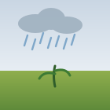

# 🌾 Tatva Agro System

### AI-Powered Smart Agriculture Platform for Farmers

Making crop insurance, farm monitoring, government schemes, and AI-driven agriculture accessible from one unified platform.

---

---

### 🧭 Quick Navigation

---

# TATVA – Technology Assisted Training for Versatile Agriculture

TATVA is an AI driven precision agriculture ecosystem designed to empower Indian farmers through intelligent, data driven decision making across the complete agricultural lifecycle. The platform bridges the gap between advanced agricultural technology and practical farming by combining satellite intelligence, environmental analysis, soil intelligence, computer vision, predictive analytics and multimodal artificial intelligence into a single farmer friendly ecosystem. Rather than exposing complex scientific reports or technical metrics, TATVA transforms sophisticated AI outputs into simple, actionable recommendations that can be understood and implemented by farmers regardless of their educational background or digital literacy. The platform focuses on improving agricultural productivity, profitability, sustainability and financial security while reducing crop losses, optimizing resource utilization and promoting climate resilient farming practices across India.

---

### ⚙️ TECHNICAL PERSPECTIVE

# TECHNICAL PERSPECTIVE

---

## Problem Statement

Indian agriculture continues to face multiple challenges including unpredictable monsoons, declining soil fertility, climate variability, pest outbreaks, inefficient resource utilization, lack of localized advisory systems, delayed insurance processing and poor access to scientific agricultural knowledge. Most small and marginal farmers still depend on traditional experience instead of environmental intelligence, resulting in lower productivity and higher financial risks. Existing agricultural solutions generally solve isolated problems instead of providing an integrated decision support ecosystem throughout the farming lifecycle.

---

## Solution Overview

TATVA provides an end to end AI powered precision agriculture platform that assists farmers from land registration until harvest and market sale. The platform integrates environmental intelligence, crop planning, disease diagnostics, yield prediction, market forecasting, insurance verification, autonomous alerting, multilingual assistance and floriculture planning into one unified ecosystem. Every recommendation generated by the system is translated into practical guidance using simple language instead of technical reports, enabling farmers to make informed decisions with confidence.

---

## System Architecture

The platform follows a modern cloud native architecture developed using Next.js, React, TypeScript and Node.js. MongoDB serves as the primary database for storing farmer profiles, land registrations, agricultural records and analytical outputs. Authentication is managed through NextAuth.js while the frontend is designed using Tailwind CSS and Shadcn UI to provide a responsive and accessible experience across desktop and mobile devices. The architecture follows modular development principles allowing every AI service to operate independently while remaining tightly integrated within the ecosystem.

| Layer | Technology |
|---|---|
| 🖥️ Frontend | Next.js · React · TypeScript · Tailwind CSS · Shadcn UI |
| ⚙️ Backend | Node.js |
| 🗄️ Database | MongoDB |
| 🔐 Auth | NextAuth.js |
| 🧠 AI Core | Google Gemini |

---

## Artificial Intelligence Infrastructure

Artificial Intelligence acts as the foundation of TATVA. Google Gemini 3.5 serves as the primary reasoning engine responsible for contextual understanding, agricultural advisory generation, recommendation synthesis, multilingual content generation and natural language explanations. Instead of producing generic responses, Gemini combines environmental observations, satellite information, soil characteristics, weather intelligence and predictive analytics to generate highly contextual recommendations for farmers.

The AI engine supports natural language understanding, structured reasoning, multimodal image interpretation, contextual recommendation generation, multilingual response generation, agricultural advisory synthesis, document understanding, conversational assistance and explainable artificial intelligence. Every response generated by the platform prioritizes simplicity, clarity and practical implementation instead of scientific complexity.

---

## AI Crop Recommendation Engine

The crop recommendation engine evaluates registered farmland using environmental intelligence, soil characteristics, climatic conditions and localized weather forecasts to identify the most suitable crops for cultivation. Instead of recommending crops solely based on historical practices, the system generates scientifically optimized recommendations that maximize productivity while reducing cultivation risks. Every recommendation is accompanied by a simple explanation that enables farmers to understand why a particular crop has been recommended.

---

## Crop Health Analysis

Farmers can upload crop images directly into the platform for AI powered diagnosis. Computer vision models process uploaded images to detect diseases, nutrient deficiencies and pest infestations during early stages. Following diagnosis, the AI generates a complete week wise treatment roadmap including preventive measures, recovery guidance, cultivation precautions and recommended farming practices. All recommendations are presented using simple language suitable for practical implementation.

---

## Yield Prediction and Market Intelligence

The platform continuously combines environmental observations, crop growth information, historical agricultural records and predictive analytics to estimate expected crop yield. Simultaneously, market intelligence models evaluate historical price patterns, seasonal demand and regional trends to forecast profitable selling opportunities. Farmers receive actionable recommendations regarding harvesting periods and market timing to maximize profitability.

---

## Floriculture Planning Module

TATVA includes a dedicated floriculture planning ecosystem specifically designed for flower cultivation. Farmers can select an existing registered plot together with their preferred flower variety. The AI evaluates environmental suitability, climatic compatibility, soil conditions and expected market opportunities before generating a Flower Suitability Gauge ranging from zero to one hundred. The recommendation is categorized as Highly Recommended, Can Be Cultivated with Proper Care or Not Recommended. The accompanying advisory explains cultivation strategies, expected flowering period, market opportunities and practical precautions using simple farmer friendly language.

---

## AI Insurance Verification

The insurance verification module introduces secure live image validation to eliminate fraudulent crop insurance claims. Farmers capture live evidence directly through the platform while artificial intelligence verifies image authenticity before forwarding claims for further processing. This significantly improves transparency while reducing verification delays for genuine farmers.

---

## Autonomous Alerting Engine

A continuous monitoring engine evaluates weather forecasts, environmental intelligence, crop health observations and agricultural anomalies throughout the cultivation period. Whenever unusual weather conditions, disease risks, irrigation concerns, dry spells or other threats are detected, the platform automatically generates personalized email alerts allowing farmers to take preventive action before severe losses occur.

---

## Voice Intelligence and Multilingual Support

The platform supports voice driven interaction across more than ten Indian languages using speech to text and text to speech technologies. Farmers can interact naturally with the system irrespective of literacy levels. Every AI recommendation can also be delivered through voice output, making agricultural intelligence accessible to a significantly larger rural population.

---

## Educational Assistance

Every major recommendation produced by the AI engine is accompanied by carefully selected YouTube tutorial recommendations. These educational resources allow farmers to visually understand recommended agricultural practices and improve implementation accuracy through practical demonstrations.

---

## Security

Farmer information remains protected through secure authentication, encrypted communication, controlled access management and secure storage practices. The architecture prioritizes privacy while ensuring reliable system performance and scalability.

---

### 💼 BUSINESS PERSPECTIVE

# BUSINESS PERSPECTIVE

## Elevator Pitch

TATVA is an AI powered precision agriculture ecosystem built specifically for Indian farmers. By combining satellite intelligence, environmental analytics, artificial intelligence, multilingual communication and predictive decision support into a unified platform, TATVA enables farmers to make smarter farming decisions throughout the complete agricultural lifecycle. The platform simplifies advanced agricultural intelligence into practical guidance that improves productivity, profitability and long term sustainability.

---

## Market Opportunity

India possesses one of the world's largest agricultural communities with millions of small and marginal farmers facing increasing environmental uncertainty and market volatility. Rapid digital adoption, expanding rural internet connectivity and government initiatives promoting digital agriculture create an ideal environment for intelligent agricultural ecosystems. TATVA addresses this opportunity by delivering accessible, localized and scalable agricultural intelligence specifically designed for Indian farming conditions.

---

## Value Proposition

Unlike traditional agricultural applications that focus on individual services, TATVA delivers an integrated ecosystem where every stage of cultivation is supported by artificial intelligence. Farmers receive assistance from crop selection through disease management, yield estimation, market forecasting, insurance verification, floriculture planning and educational support within a single platform, eliminating fragmentation while simplifying agricultural decision making.

---

## Revenue Model

The platform follows a diversified revenue strategy centered around sustainable long term growth. Revenue opportunities include premium subscription services, institutional licensing, agricultural advisory services, insurance verification partnerships, enterprise integrations, government collaborations, agricultural marketplaces, educational partnerships and API based service offerings while maintaining affordable accessibility for Indian farmers.

---

## Customer Retention Strategy

Farmer retention is achieved through continuous value generation rather than periodic engagement. Personalized recommendations, autonomous agricultural alerts, multilingual communication, educational assistance, seasonal advisory updates, continuous AI improvements and contextual notifications encourage farmers to actively use the platform throughout every cultivation cycle. Trust, simplicity and measurable agricultural improvements remain the primary retention drivers.

---

## Marketing Strategy

TATVA focuses on community driven adoption through agricultural cooperatives, Farmer Producer Organizations, agricultural universities, Krishi Vigyan Kendras, rural entrepreneurship initiatives, digital awareness campaigns, demonstration programs and institutional collaborations. Educational content, real world success stories and farmer centric awareness campaigns establish credibility while encouraging widespread adoption throughout rural India.

---

## Scalability

The modular architecture enables seamless expansion across different Indian states without significant architectural modifications. Support for multilingual communication, localized agricultural intelligence and configurable advisory systems allows the platform to adapt to varying climatic zones, soil conditions and cultivation practices across the country. Future enterprise deployments can extend services to government organizations, insurance providers, agricultural research institutions and large agribusinesses.

---

## Future Roadmap

Future development will focus on Internet of Things integration, real time environmental sensors, smart irrigation automation, drone based crop monitoring, blockchain enabled agricultural traceability, carbon credit estimation, advanced environmental intelligence, expanded floriculture analytics, AI driven government scheme recommendations, predictive financial advisory services, collaborative farmer communities, advanced market intelligence and deeper institutional integrations while preserving the platform's commitment to simplicity, accessibility and farmer first innovation.

---

## Vision

The long term vision of TATVA is to become India's most comprehensive farmer centric agricultural intelligence ecosystem where every farming decision is supported by trustworthy artificial intelligence, localized environmental intelligence and practical recommendations. By making advanced technology understandable and accessible, TATVA aims to strengthen rural livelihoods, improve food security, increase agricultural profitability and accelerate the digital transformation of Indian agriculture.

---

### ⭐ If TATVA resonates with you, consider starring the repository

