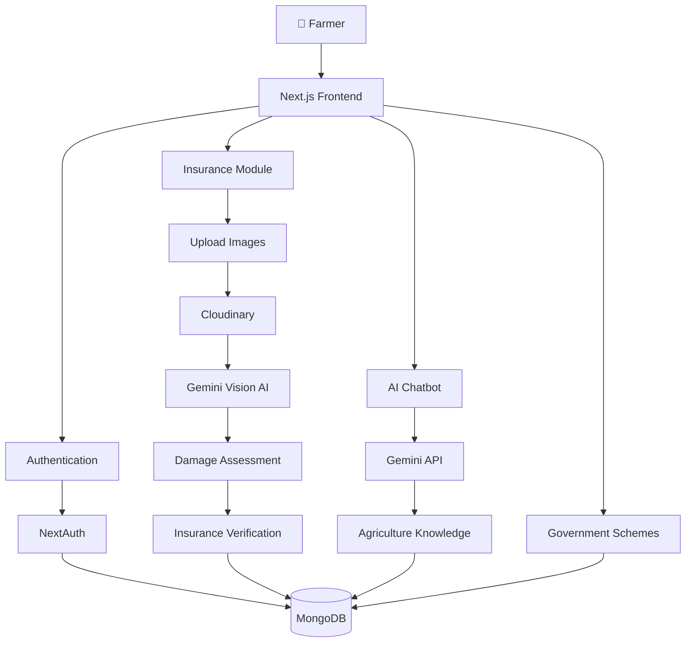
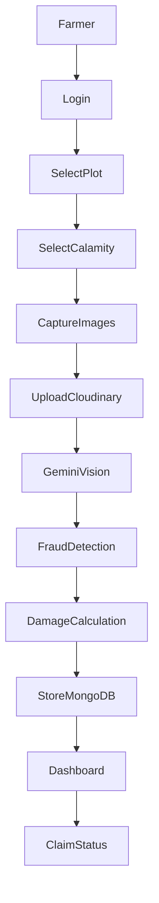
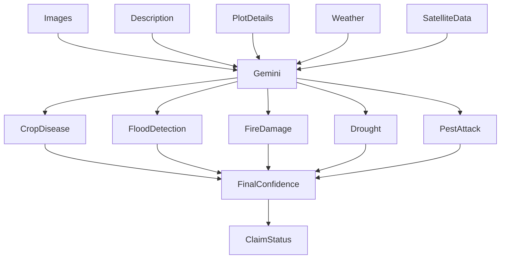
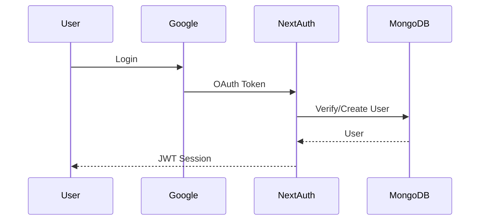
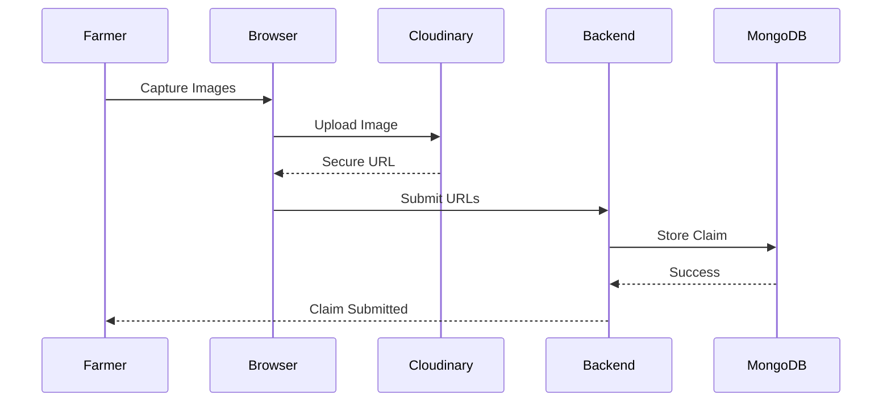
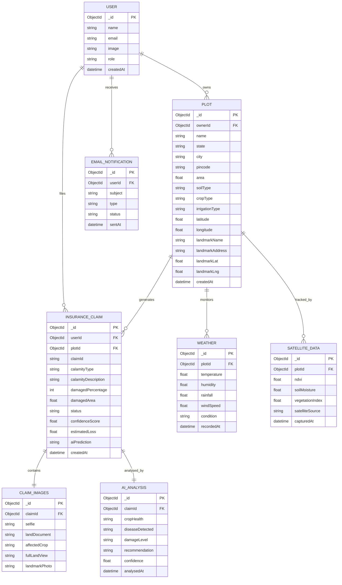

<div align="center">

# 🌾 Tatva Agro System

### AI-Powered Smart Agriculture Platform for Farmers

<p align="center">
Making crop insurance, farm monitoring, government schemes, and AI-driven agriculture accessible from one unified platform.
</p>

---


</div>

---

# 🌱 About

Tatva Agro System is an AI-enabled precision agriculture ecosystem that empowers farmers with modern digital agriculture tools.

The platform combines Artificial Intelligence, Satellite Intelligence, Computer Vision, Government Scheme Assistance, Crop Insurance, Smart Recommendations, and Agricultural Analytics into one seamless experience.

Instead of visiting multiple government portals and manually filing claims, farmers can perform every major agricultural activity from one platform.

---

# ✨ Key Features

## 🌾 AI Crop Insurance

- AI-powered claim verification
- Smart fraud detection
- Crop damage estimation
- Image verification
- Landmark validation
- Farmer selfie verification
- AI damage assessment
- Automated insurance workflow

---

## 🤖 AI Agriculture Assistant

- Gemini-powered chatbot
- Multi-language support
- Farming guidance
- Fertilizer recommendation
- Crop disease assistance
- Weather-based suggestions
- Government scheme guidance

---

## 🛰 Smart Farm Monitoring

- Farm registration
- GPS location tracking
- Landmark verification
- Plot management
- Farm history
- Location intelligence

---
## ⚡ Technology Stack

| Category | Technologies |
|-----------|--------------|
| Frontend | Next.js 15, React 19, TailwindCSS |
| Backend | Next.js API Routes |
| Authentication | NextAuth |
| AI | Gemini 2.5 Pro |
| Database | MongoDB Atlas |
| Storage | Cloudinary |
| ORM | Mongoose |
| Language | TypeScript |
| UI | Shadcn UI |
| Animation | Framer Motion |
| Icons | Lucide React |

---

## 📊 AI Analytics Dashboard

- Crop statistics
- Insurance analytics
- Farm performance
- Smart insights
- Claim tracking
- Progress visualization

---

## 📄 Government Schemes

- PM-KISAN
- PMFBY
- Soil Health Card
- KCC
- State Government Schemes
- AI eligibility checker

---

## 📷 AI Computer Vision

Users upload:

- Farmer Selfie
- Land Document
- Crop Damage
- Entire Land
- Landmark Image

The AI verifies all uploaded images before processing the insurance claim.

---

## 🔒 Secure Authentication

- Google Authentication
- JWT Sessions
- Protected Routes
- Secure APIs

---

## ☁ Cloud Storage

- Cloudinary Integration
- Secure Image Storage
- Automatic Image Optimization

---
## 🏗 System Architecture



---

# 📂 Project Structure

```
Tatva-Agro-System/

│

├── app/

│ ├── dashboard/

│ ├── insurance/

│ ├── chatbot/

│ ├── profile/

│ ├── schemes/

│ ├── api/

│

├── components/

│ ├── UI

│ ├── Dashboard

│ ├── Insurance

│ ├── Chatbot

│

├── models/

├── lib/

├── middleware.ts

├── types/

└── README.md

```

---

## 🌾 Insurance Claim Workflow


---
## 🤖 Gemini AI Decision Engine



---


## 🔐 Authentication


---
## ☁ Cloudinary Upload Workflow


---
## 🌍 Business Overview

Tatva is an AI-powered smart agriculture platform designed to bridge the gap between farmers, technology, and insurance providers. The platform digitizes land registration, crop monitoring, weather intelligence, and insurance claim processing into a single ecosystem.

Unlike traditional agricultural platforms, Tatva leverages Artificial Intelligence, satellite-assisted monitoring, and secure cloud infrastructure to minimize fraudulent claims while ensuring faster claim settlements for genuine farmers.

The primary objective is to improve transparency, reduce manual verification efforts, and provide timely financial assistance to farmers affected by natural calamities.

---
## 👥 Consumer Section

Tatva serves multiple stakeholders across the agricultural ecosystem.

### 👨‍🌾 Farmers
- Register agricultural plots digitally.
- Monitor crop conditions.
- Receive weather forecasts.
- Submit insurance claims with AI verification.
- Track claim approval status.

### 🏛 Government Authorities
- Monitor insurance claims.
- Reduce fraudulent applications.
- Generate district-wise agricultural reports.
- Improve subsidy distribution.

### 🏢 Insurance Providers
- Automated claim verification.
- AI-assisted damage assessment.
- Faster settlement process.
- Reduced operational cost.

### 🌱 Agricultural Researchers
- Crop damage analytics.
- Weather impact studies.
- Satellite vegetation monitoring.
- Regional agricultural insights.
---

## 💰 Revenue Model

Tatva follows a hybrid B2B + B2G + SaaS business model.

| Revenue Stream | Description |
|---------------|-------------|
| Government Licensing | Annual deployment for state agriculture departments |
| Insurance Partnerships | AI claim verification subscription |
| Enterprise Dashboard | Analytics for agribusiness companies |
| Premium Farmer Services | Personalized AI recommendations |
| API Services | Weather and satellite analytics APIs |
| Data Insights | Anonymous agricultural reports for research organizations |

Future monetization may also include IoT integrations, drone monitoring subscriptions, and AI-powered crop advisory services.

---
## 📈 Marketing & Scaling Strategy

### Phase 1
- Pilot deployment in selected districts.
- Partner with local farmer cooperatives.
- Collaborate with agricultural universities.

### Phase 2
- Government partnerships under PMFBY.
- Insurance company integration.
- Regional language support.

### Phase 3
- Nationwide deployment.
- Mobile application launch.
- AI-powered farming assistant.
- International expansion to developing agricultural economies.
---
## ❤️ Customer Retention

Tatva focuses on long-term farmer engagement through continuous value delivery.

- Personalized crop recommendations.
- Seasonal weather alerts.
- Insurance renewal reminders.
- AI-powered disease detection.
- Historical crop analytics.
- Loyalty rewards for consistent usage.
- Community discussion forums.
- Regional language support.
---
## 🎯 Value Proposition

### Farmers

- Faster insurance processing
- Accurate weather updates
- Secure land registration
- AI-assisted crop monitoring

### Government

- Transparent subsidy management
- Reduced fraud
- Digital agricultural records

### Insurance Companies

- Lower verification costs
- Automated fraud detection
- Faster settlements

### Society

- Improved food security
- Digital agriculture ecosystem
- Better disaster response

---
# 📦 Installation

Clone the repository

```bash
git clone https://github.com/Megh2005/Tatva-Agro-System.git
```

Go inside the project

```bash
cd Tatva-Agro-System
```

Install dependencies

```bash
pnpm install
```

Run development server

```bash
pnpm dev
```

---

# ⚙ Environment Variables

Create

```
.env.local
```

```env
MONGODB_URI=

GOOGLE_CLIENT_ID=

GOOGLE_CLIENT_SECRET=

NEXTAUTH_SECRET=

NEXTAUTH_URL=

GEMINI_API_KEY=

CLOUDINARY_CLOUD_NAME=

CLOUDINARY_API_KEY=

CLOUDINARY_API_SECRET=
```

---
## ♿ Accessibility

Tatva aims to make digital agriculture accessible to every farmer.

Current Features

- Responsive mobile interface
- Large touch-friendly buttons
- High contrast UI
- Simple navigation
- Google Authentication
- Error validation
- AI-assisted text enhancement

Future Improvements

- Voice navigation
- Regional language support
- Screen reader compatibility
- Offline mode
- Voice-based insurance filing
- AI chatbot with multilingual support
---

## 🌟 User Experience

Tatva has been designed with simplicity and accessibility as the primary goals.

### Design Principles

- Clean and distraction-free interface.
- Mobile-first responsive design.
- Minimal learning curve.
- One-click authentication.
- Guided insurance claim process.
- AI-assisted form completion.
- Real-time feedback.
- Modern animations for better engagement.

The interface minimizes technical complexity so that farmers with limited digital literacy can comfortably navigate the platform.

----

## 🌟 Why Tatva?

✔ AI-powered insurance verification

✔ Satellite-assisted crop monitoring

✔ Real-time weather intelligence

✔ Secure Google Authentication

✔ Automated email notifications

✔ Cloud image storage

✔ Smart damage assessment

✔ Modern responsive UI

✔ PMFBY-inspired insurance workflow

✔ End-to-end digital farming ecosystem

---

## 🗄️ Database ER Diagram



----

# 👨‍💻 Developer

**Megh Deb**

GitHub:
https://github.com/Megh2005

---

<div align="center">

### 🌾 Building the Future of Smart Agriculture with Artificial Intelligence 🌾


</div>
